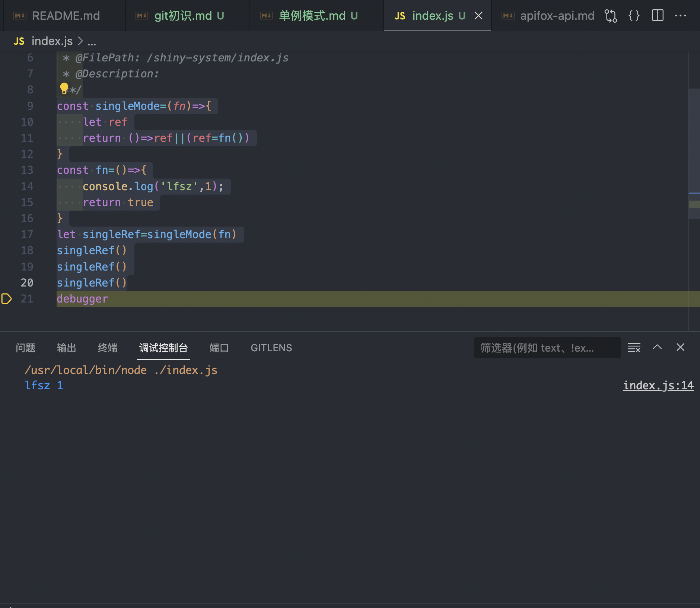

# 单例模式
## 一、功能
全局只能有一个实例，像是登陆弹窗，全局只能有一个，于是就有了单例模式，为避免污染全局变量，运用闭包，改变变量的生命周期。单例模式分为两个函数，一个函数用来处理全局只能有一个实例的逻辑，另外一个函数用来处理具体的业务逻辑。单例模式最好采用惰性单例模式，也就是当要用到单例的时候才会调用业务逻辑。
## 二、代码
```js
const singleMode=(fn)=>{
    let ref
    return ()=>ref||(ref=fn())
}
const fn=()=>{
    console.log('lfsz',1);
    return true
}
let singleRef=singleMode(fn)
singleRef()
singleRef()
singleRef()
```
